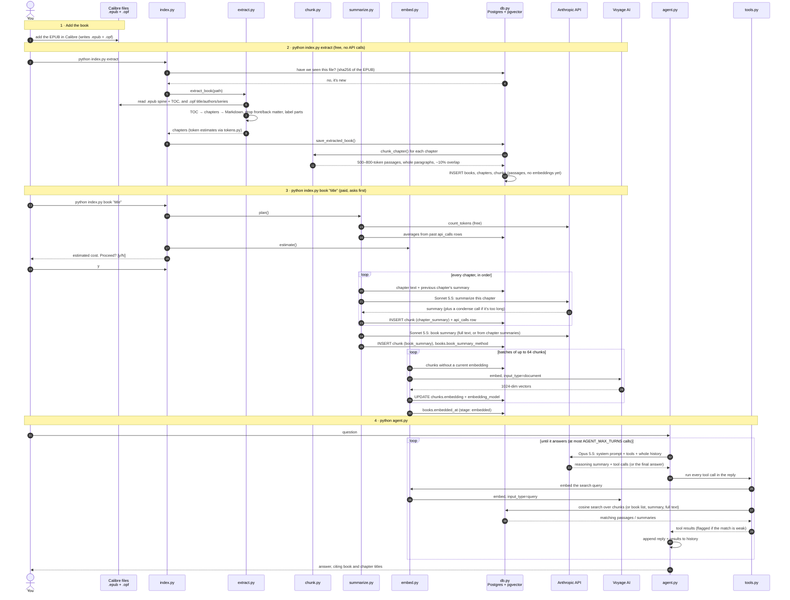

# Pipeline: from a new book to the agent

How each file is used, in order, from adding an EPUB to asking the agent about it. Time runs
top to bottom, and each column is a file or service. `config.py` (settings from `.env`) is used at
every step, and every database read or write goes through `db.py`, which creates the tables from
`schema.sql` on first use.

The HTTP API (`api.py`) runs this same flow:
- **Adding books:** `POST /library/scan` runs step 2 over `LIBRARY_PATH`. It never re-extracts a
  book that has paid work.
- **Indexing:** `POST /books/{id}/index` runs step 3 through `jobs.py`, the same code as
  `index.py book`, after checking the estimate against the caller's `max_cost_usd`. Locally the
  job runs in a background thread. When deployed, the API starts a Cloud Run Job execution of
  `python index.py run-job <id>`, which re-estimates, refuses to exceed the limit, and records
  progress and the actual cost on the job.
- **Questions:** `POST /ask` runs step 4's agent loop, storing the conversation in Postgres
  instead of keeping it in memory.

Deployed, step 1 also uploads the book: `deploy/sync-library.sh` copies the Calibre library to a
Cloud Storage bucket, which the API reads as a read-only folder at `LIBRARY_PATH`. Every other
step is the same code, with Cloud SQL in place of the local Postgres. The
[README](README.md#deployment) shows where each piece runs.

## The same flow in words

| Step | Command | Files involved | External calls | Writes |
|---|---|---|---|---|
| 1 | add the book in Calibre | `.epub`, `.opf` | – | – |
| 2 | `python index.py extract` | `index.py` → `extract.py` → `chunk.py` (both use `tokens.py`) → `db.py` | none | `books`, `chapters`, `chunks` (passages) |
| 3a | `python index.py status` / `book --dry-run` | `index.py`, `summarize.py` (plan), `embed.py` (estimate) | `count_tokens` (free) | `books.exact_token_count` |
| 3b | `python index.py book <id>` → `y` | `summarize.py` | Sonnet 5.5, one call per chapter + one for the book (+ condense if needed) | `chunks` (summaries), `books`, `api_calls` |
| 3c | (same command, continued) | `embed.py` | Voyage, batched `document` embeddings | `chunks.embedding`, `books.embedded_at` |
| 4 | `python agent.py` | `agent.py` ⇄ Opus 5.5; `tools.py` → `embed.py` (query) + `db.py` | Opus 5.5 each step; Voyage once per search | nothing (read-only) |

Read-only helpers along the way: `python index.py summaries <book>` (reads summary chunks) and
`python index.py search "…"` (embeds a query with `embed.py`, then runs the same cosine search the agent uses).
