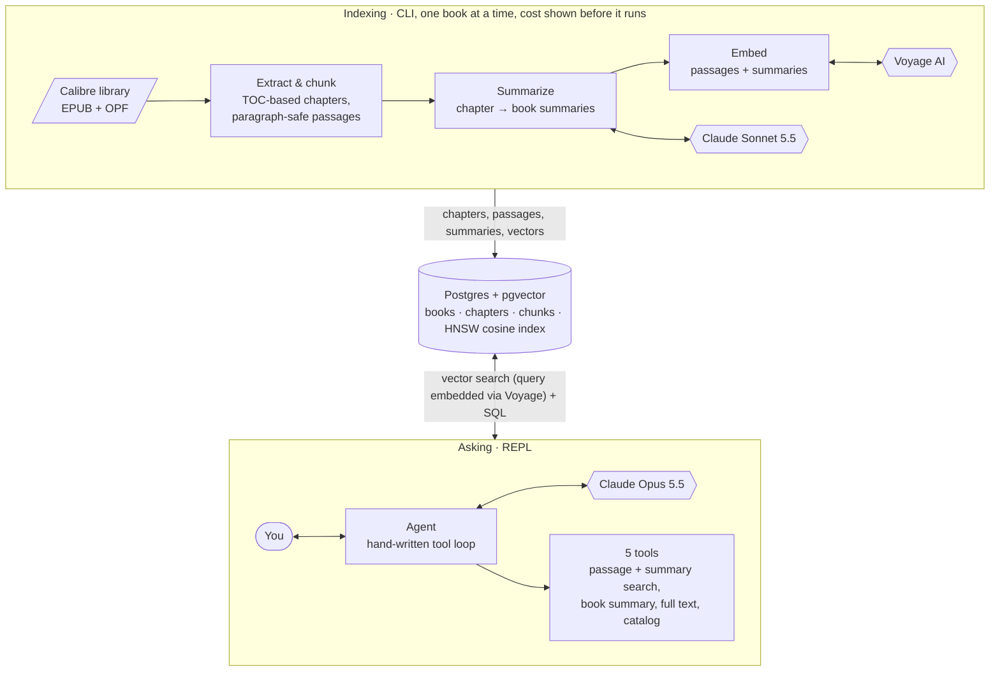

# Library RAG Agent

Ask questions about your own ebook library and get answers that cite the book and chapter.

This project indexes a Calibre EPUB library into Postgres + pgvector, builds chapter- and
book-level summaries with Claude, and answers questions through a **hand-written tool-calling
agent**. There is no agent framework: the loop is about 120 lines of plain Python on the Anthropic
SDK. Everything runs locally except the model and embedding API calls.


<sub>Recorded with [vhs](https://github.com/charmbracelet/vhs) from [`demo.tape`](demo.tape) against a real library and live API.</sub>

```text
you> What happens the first time the girls try a spell from the witch book?

→ search_passages(query="girls try their first spell from the witch book")
  ← 8 results, top 0.58: Witchcraft for Wayward Girls, "Chapter 11 (30 WEEKS)"
→ search_passages(query="Turnabout spell Zinnia morning sickness Dr. Vincent vomits", book_id=10, k=5)
  ← 5 results, top 0.55: Witchcraft for Wayward Girls, "Chapter 10 (30 WEEKS)"

Their first spell is Turnabout, used to move Zinnia's morning sickness onto Dr. Vincent. They
slide an egg over Zinnia's belly while chanting "Rise and fill and leave behind"...
(Witchcraft for Wayward Girls, "Chapter 10 (30 WEEKS)")
```

## How it works



1. **Extract** (free, no API calls): each EPUB becomes ordered, cleaned Markdown chapters,
   which are split into 500–800-token passages.
2. **Summarize** (Claude Sonnet 5.5): a summary for every chapter, then one for the whole book.
3. **Embed** (Voyage AI): passages and summaries become vectors in an HNSW index.
4. **Ask** (Claude Opus 5.5): the agent picks tools by question type. It uses passage search for
   specific scenes, summary search for themes and arcs, and full text for deep single-book
   analysis. It cites the chapter for every claim.

[PIPELINE.md](PIPELINE.md) walks through the same flow file by file as a sequence diagram.

## Design decisions

**Chapters come from the table of contents, not from files.** EPUBs disagree about what a file
is. Some use one file per chapter. Some are a few huge files with chapters marked only by TOC
anchors, which is common in MOBI conversions. Others split chapters across files.
[`extract.py`](extract.py) cuts the reading-order documents at TOC anchors, then groups the pieces
into chapters:
- **Numbered chapters:** when a flat TOC mixes numbered chapters with section headings, the
  unnumbered entries become sections inside a chapter.
- **Part dividers:** "Part I", or a book's "27 WEEKS" pages, label every chapter that follows them
  instead of being thrown away.
- **Front and back matter:** cover, copyright, "also by", ads and similar pages are filtered by
  EPUB guide type, file name, TOC title, and content checks (copyright text, link-heavy contents
  pages, foreign-language ad inserts).
- **Explanations:** `python index.py extract --dry-run -v` prints every keep, merge or skip
  decision with its reason.

**Chunks never cross chapters or split paragraphs.** Paragraphs are packed into 500–800-token
passages, and each passage overlaps the previous one by its trailing whole paragraphs (~10%). A
single oversized paragraph becomes its own chunk rather than being cut. Because every passage
belongs to exactly one chapter, citations are always clean.

**Hierarchical summaries with enforced length.**
- **Chapter summaries:** these see the previous chapter's summary, so returning characters and
  shifts in tone are recognized. Each uses fixed sections: what happens, characters (or key
  concepts for nonfiction), motifs and recurring images, unresolved threads, tone.
- **Book summaries:** written from the full text when the book fits in the model's context, and
  from the chapter summaries otherwise. Which method was used is recorded. Their length scales with
  the book: 600–1000 words for short books, up to 2000 for long ones.
- **Length limits:** models overshoot word targets, so each section gets its own word range, and
  anything still over the limit is condensed by a follow-up call.

**Spending is explicit, and estimates calibrate themselves.**
- **Free extraction, paid indexing:** extraction runs over the whole library at no cost. Paid work
  runs per book (`python index.py book <title>`), behind one combined cost estimate and a `y/N`
  prompt. Bulk commands refuse to run without an explicit `--all`.
- **Estimates:** they use Anthropic's free `count_tokens` endpoint for input. Output is estimated
  from logged usage: every summary call is recorded in an `api_calls` table, and the estimate uses
  recent averages for the current model, effort level and prompt version. The first full run after
  calibration landed within 1% of the actual bill.

**A hand-written agent loop** ([`agent.py`](agent.py)), built to show how the loop actually works:
- **Append-only history:** the model's replies are appended exactly as returned, including thinking
  blocks that the API requires to be sent back unchanged. History is never edited, which also
  keeps prompt caching effective (most input is billed at the 5% cache-read rate).
- **Several tool calls per reply:** every tool call in a reply runs, and all results go back in a
  single message. Failures return `is_error` results the model can recover from.
- **Graceful step limit:** `AGENT_MAX_TURNS` caps the steps per question. On the last step, tools
  are turned off and the model is told to answer with what it has, so it never stops mid-thought.
- **Failure handling:** a question that fails partway (API error, Ctrl-C, refusal) is rolled back,
  so the conversation stays valid.

**Retrieval details that turned out to matter:**
- **Contextual headers:** each chunk is embedded with a header naming the book, author and chapter,
  so queries that mention them match. The stored text stays clean.
- **Filtered vector search:** searches restricted to one book or one summary level use pgvector's
  iterative HNSW scans, so filters don't silently return fewer results than asked for.
- **Soft weak-match flag:** similarity scores swing with how a query is worded. In testing, correct
  hits scored 0.26–0.66 and a short correct query scored 0.17. So low scores are flagged as "check
  relevance before relying on these" rather than "no answer", and the model decides from content.
- **Model tracking:** each vector stores the model that produced it, so switching embedding models
  marks old vectors stale instead of mixing incompatible ones.

## Results

| | Size | Cost to index | Notes |
|---|---|---|---|
| *Tuesdays With Morrie* | 66K tokens, 27 chapters | ≈ $0.55 | memoir |
| *Witchcraft for Wayward Girls* | 259K tokens, 38 chapters | ≈ $1.55 | novel; estimate $1.57 |
| Agent question | 1–5 tool calls | ≈ $0.10–0.20 | Opus 5.5 at `high` effort, with prompt caching |

The indexing costs are summaries (Sonnet 5.5, `medium` effort) plus embeddings
(voyage-4-large, under $0.03 a book).

## Setup

**Requirements:** Python 3.12, Docker, an Anthropic API key, and a Voyage AI key. OpenAI
embeddings are also supported. Your Voyage account needs a payment method on file to get normal
rate limits; its free token allowance still applies. You also need a folder of EPUBs. A Calibre
library is ideal, because its `.opf` files supply clean metadata.

```sh
git clone <this repo> && cd library-rag-agent
cp .env.example .env              # add API keys, set LIBRARY_PATH and a Postgres password
docker compose up -d              # Postgres + pgvector
python3 -m venv .venv && source .venv/bin/activate
pip install -r requirements.txt
```

## Usage

```sh
python index.py extract           # catalog every EPUB: chapters + passages (free)
python index.py status            # each book's stage and estimated cost to finish
python index.py book "wayward"    # summarize + embed one book (shows cost, asks y/N)
python index.py summaries wayward # read the generated summaries
python agent.py                   # ask questions (/usage, /reset, /quit)
```

Books can be named by id or by words from the title or author. [SHORTCUTS.md](SHORTCUTS.md)
lists every command, including debugging tools (`--dry-run -v`, raw vector `search`) and direct
database access.

## Project layout

| File | Role |
|---|---|
| [`extract.py`](extract.py) | EPUB → metadata + TOC-based chapters (Markdown), front/back-matter filtering |
| [`chunk.py`](chunk.py) | chapter → overlapping, paragraph-safe passages |
| [`summarize.py`](summarize.py) | chapter and book summaries, length control, cost estimation |
| [`embed.py`](embed.py) | `Embedder` interface (Voyage, OpenAI), batching, retries with backoff |
| [`agent.py`](agent.py) | REPL and the hand-written tool loop |
| [`tools.py`](tools.py) | tool schemas the model sees, and the code that runs them |
| [`db.py`](db.py), [`schema.sql`](schema.sql) | Postgres access and schema (`books`, `chapters`, `chunks`, `api_calls`) |
| [`index.py`](index.py) | indexing CLI: `extract`, `status`, `book`, `summaries`, `search`, … |
| [`config.py`](config.py), [`tokens.py`](tokens.py) | settings from `.env`; local token estimate |

## Limitations and next steps

- **Full-book loading** uses a flat 150K-token limit, so most novels go through summaries and
  search instead. The next step is a limit based on how much room is left in the session
  ([TODO.md](TODO.md)).
- **Library changes:** renaming a book in Calibre, or letting Calibre rewrite the EPUB, currently
  looks like a new book, which redoes paid work. Change detection should key on Calibre's book ID
  and content hash, and ask before discarding summaries.
- **Local token estimates** (characters ÷ 3.8) are used only for chunk sizing and dry runs. Real
  counts come from the API.
- **Single-user and local** by design: no web server, no auth.

## How this was built

I built this with [Claude Code](https://claude.com/claude-code) as a pair programmer. I wrote the
spec and broke it into phases (extraction, summaries, embeddings, agent). I tested each phase on
my own library before moving to the next, and made the design calls along the way, often by choosing
between options Claude Code laid out. Claude Code wrote most of the implementation.

Several of the decisions above came from that testing:
- **One book at a time:** I switched to indexing books individually after seeing the first
  whole-library cost estimate.
- **Enforced summary length:** I added length limits after reading the first round of summaries.
- **Read-only agent:** I kept indexing in the CLI, so the agent can't spend money on its own.
- **Extraction fixes:** the opening-frame and part-divider fixes came from testing on a novel I'd
  just read, where I could tell what the extractor should have kept.
