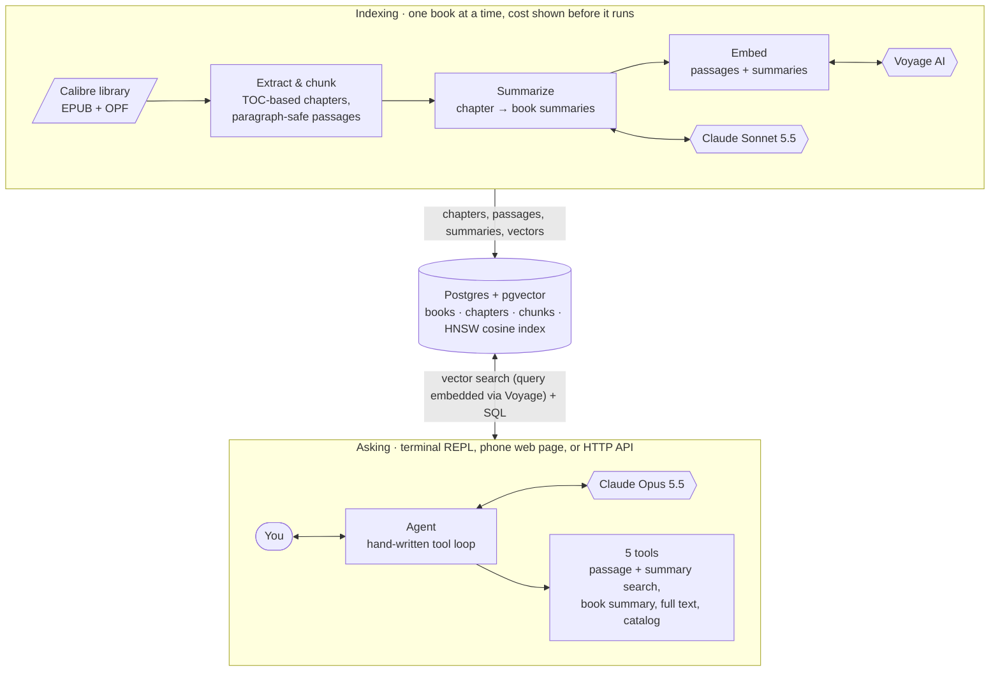
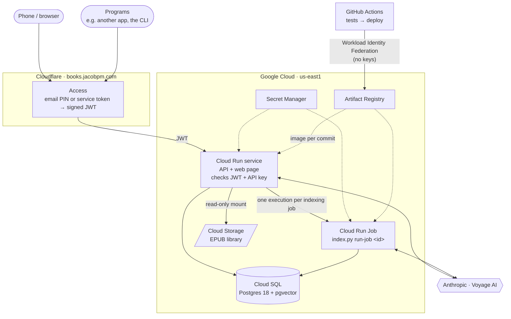

# Chapter and Verse

[](https://github.com/jacobpmeyer/chapter-and-verse/actions/workflows/tests.yml)

Ask questions about your own ebook library and get answers that cite the book and chapter.

This project indexes a Calibre EPUB library into Postgres + pgvector, builds chapter- and
book-level summaries with Claude, and answers questions through a **hand-written tool-calling
agent**. There is no agent framework: the loop is about 120 lines of plain Python on the Anthropic
SDK. It's deployed on Cloud Run + Cloud SQL behind Cloudflare Access, and the same code runs
entirely locally with Docker Compose.


<sub>Recorded with [vhs](https://github.com/charmbracelet/vhs) from [`demo.tape`](demo.tape) against a real library and live API.</sub>

```text
you> What happens the first time the girls try a spell from the witch book?

→ search_passages(query="girls try their first spell from the witch book")
  ← 8 results, top 0.58: Witchcraft for Wayward Girls, "Chapter 11 (30 WEEKS)"
→ search_passages(query="Turnabout spell Zinnia morning sickness Dr. Vincent vomits", book_id=10, k=5)
  ← 5 results, top 0.55: Witchcraft for Wayward Girls, "Chapter 10 (30 WEEKS)"

Their first spell is Turnabout, used to move Zinnia's morning sickness onto Dr. Vincent. They
slide an egg over Zinnia's belly while chanting "Rise and fill and leave behind"...
(Witchcraft for Wayward Girls, "Chapter 10 (30 WEEKS)")
```

## How it works



1. **Extract** (free, no API calls): each EPUB becomes ordered, cleaned Markdown chapters,
   which are split into 500–800-token passages.
2. **Summarize** (Claude Sonnet 5.5): a summary for every chapter, then one for the whole book.
3. **Embed** (Voyage AI): passages and summaries become vectors in an HNSW index.
4. **Ask** (Claude Opus 5.5): the agent picks tools by question type. It uses passage search for
   specific scenes, summary search for themes and arcs, and full text for deep single-book
   analysis. It cites the chapter for every claim.

[PIPELINE.md](PIPELINE.md) walks through the same flow file by file as a sequence diagram.

## Design decisions

**Chapters come from the table of contents, not from files.** EPUBs disagree about what a file
is. Some use one file per chapter. Some are a few huge files with chapters marked only by TOC
anchors, which is common in MOBI conversions. Others split chapters across files.
[`extract.py`](extract.py) cuts the reading-order documents at TOC anchors, then groups the pieces
into chapters:
- **Numbered chapters:** when a flat TOC mixes numbered chapters with section headings, the
  unnumbered entries become sections inside a chapter.
- **Part dividers:** "Part I", or a book's "27 WEEKS" pages, label every chapter that follows them
  instead of being thrown away.
- **Front and back matter:** cover, copyright, "also by", ads and similar pages are filtered by
  EPUB guide type, file name, TOC title, and content checks (copyright text, link-heavy contents
  pages, foreign-language ad inserts).
- **Explanations:** `python index.py extract --dry-run -v` prints every keep, merge or skip
  decision with its reason.

**Chunks never cross chapters or split paragraphs.** Paragraphs are packed into 500–800-token
passages, and each passage overlaps the previous one by its trailing whole paragraphs (~10%). A
single oversized paragraph becomes its own chunk rather than being cut. Because every passage
belongs to exactly one chapter, citations are always clean.

**Hierarchical summaries with enforced length.**
- **Chapter summaries:** these see the previous chapter's summary, so returning characters and
  shifts in tone are recognized. Each uses fixed sections: what happens, characters (or key
  concepts for nonfiction), motifs and recurring images, unresolved threads, tone.
- **Book summaries:** written from the full text when the book fits in the model's context, and
  from the chapter summaries otherwise. Which method was used is recorded. Their length scales with
  the book: 600–1000 words for short books, up to 2000 for long ones.
- **Length limits:** models overshoot word targets, so each section gets its own word range, and
  anything still over the limit is condensed by a follow-up call.

**Spending is explicit, and estimates calibrate themselves.**
- **Free extraction, paid indexing:** extraction runs over the whole library at no cost. Paid work
  runs per book (`python index.py book <title>`), behind one combined cost estimate and a `y/N`
  prompt. Bulk commands refuse to run without an explicit `--all`.
- **Estimates:** they use Anthropic's free `count_tokens` endpoint for input. Output is estimated
  from logged usage: every summary call is recorded in an `api_calls` table, and the estimate uses
  recent averages for the current model, effort level and prompt version. The first full run after
  calibration landed within 1% of the actual bill.

**A hand-written agent loop** ([`agent.py`](agent.py)), built to show how the loop actually works:
- **Append-only history:** the model's replies are appended exactly as returned, including thinking
  blocks that the API requires to be sent back unchanged. History is never edited, which also
  keeps prompt caching effective (most input is billed at the 5% cache-read rate).
- **Several tool calls per reply:** every tool call in a reply runs, and all results go back in a
  single message. Failures return `is_error` results the model can recover from.
- **Graceful step limit:** `AGENT_MAX_TURNS` caps the steps per question. On the last step, tools
  are turned off and the model is told to answer with what it has, so it never stops mid-thought.
- **Failure handling:** a question that fails partway (API error, Ctrl-C, refusal) is rolled back,
  so the conversation stays valid.

**Retrieval details that turned out to matter:**
- **Contextual headers:** each chunk is embedded with a header naming the book, author and chapter,
  so queries that mention them match. The stored text stays clean.
- **Filtered vector search:** searches restricted to one book or one summary level use pgvector's
  iterative HNSW scans, so filters don't silently return fewer results than asked for.
- **Soft weak-match flag:** similarity scores swing with how a query is worded. In testing, correct
  hits scored 0.26–0.69 and a short correct query scored 0.17. So low scores are flagged as "check
  relevance before relying on these" rather than "no answer", and the model decides from content.
- **Model tracking:** each vector stores the model that produced it, so switching embedding models
  marks old vectors stale instead of mixing incompatible ones.

## Results

| | Size | Cost to index | Notes |
|---|---|---|---|
| *Tuesdays With Morrie* | 66K tokens, 27 chapters | ≈ $0.55 | memoir |
| *Witchcraft for Wayward Girls* | 259K tokens, 38 chapters | ≈ $1.55 | novel; estimate $1.57 |
| *How to Read a Book* | 244K tokens, 24 chapters | $1.30 | nonfiction; estimate $1.31; indexed by a Cloud Run Job in 4 minutes |
| Agent question | 1–5 tool calls | ≈ $0.10–0.20 | Opus 5.5 at `high` effort, with prompt caching |

The indexing costs are summaries (Sonnet 5.5, `medium` effort) plus embeddings
(voyage-4-large, under $0.03 a book).

## Setup

**Requirements:** Python 3.12, Docker, an Anthropic API key, and a Voyage AI key. OpenAI
embeddings are also supported. Your Voyage account needs a payment method on file to get normal
rate limits; its free token allowance still applies. You also need a folder of EPUBs. A Calibre
library is ideal, because its `.opf` files supply clean metadata.

```sh
git clone https://github.com/jacobpmeyer/chapter-and-verse.git && cd chapter-and-verse
cp .env.example .env              # add API keys, set LIBRARY_PATH and a Postgres password
docker compose up -d              # Postgres + pgvector
python3 -m venv .venv && source .venv/bin/activate
pip install -r requirements.txt
```

## Usage

```sh
python index.py extract           # catalog every EPUB: chapters + passages (free)
python index.py status            # each book's stage and estimated cost to finish
python index.py book "wayward"    # summarize + embed one book (shows cost, asks y/N)
python index.py summaries wayward # read the generated summaries
python agent.py                   # ask questions (/usage, /reset, /quit)
```

`python index.py backup` writes a dated, verified database dump outside the project. Run it
before anything that rebuilds paid work, like `--redo-summaries`.

Books can be named by id or by words from the title or author. [SHORTCUTS.md](SHORTCUTS.md)
lists every command, including debugging tools (`--dry-run -v`, raw vector `search`) and direct
database access.

## HTTP API and web page

```sh
docker compose up -d --build      # Postgres + the API on http://localhost:8080
```

- **Web page:** open `http://localhost:8080` locally. The deployed one is behind a login (see
  [Deployment](#deployment)). It asks questions with the answer streaming in, shows tool calls and reasoning as they
  happen, browses the library, and indexes a book after confirming its estimated cost.
- **API reference:** interactive docs at `/docs`. The same API is how other projects use this as a
  service.

| Endpoint | What it does |
|---|---|
| `POST /ask` | ask the agent; `conversation_id` continues a conversation; `stream: true` for Server-Sent Events (recommended: answers can take over a minute, and the stream sends keep-alives so proxies don't time out) |
| `POST /search` | raw vector search over passages and summaries (no LLM): for callers that bring their own model |
| `GET /books`, `GET /books/{id}`, `GET /books/{id}/summary`, `…/chapters/{n}/summary` | the library and its summaries |
| `POST /library/scan` | extract new or changed EPUBs (free); never discards paid work |
| `GET /books/{id}/estimate`, `POST /books/{id}/index` | cost estimate, then an indexing job that refuses to start above `max_cost_usd` |
| `GET /jobs/{id}`, `GET /conversations[/{id}]` | job progress and actual cost; conversation history |

```sh
curl -X POST localhost:8080/ask -H "Authorization: Bearer $KEY" -H "Content-Type: application/json" \
     -d '{"question": "What are the themes of Witchcraft for Wayward Girls?"}'
```

**Controls:**
- **API keys:** every endpoint except `/health` needs a key from `API_KEYS`. Keys are
  comma-separated, so each client can have its own and lose it independently, and the server
  won't start without at least one.
- **Daily budget:** `DAILY_BUDGET_USD` caps total daily spend. Every model call (agent and
  summaries) is logged with its cost, and spending endpoints return 429 once the cap is reached.
- **Behind Cloudflare Access (deployment):** with `CF_ACCESS_TEAM_DOMAIN` and `CF_ACCESS_AUD`
  set, every request except `/health` must also carry the JWT that Access adds once someone logs
  in or a service presents its service token. The API checks the signature against the team's
  published keys, plus the audience, issuer and expiry. Without this check, the service's own URL
  would bypass the login.
- **Stateless:** conversations and indexing jobs live in Postgres, so the API can run as several
  instances, which is how it's built to deploy to Cloud Run.
- **Where indexing runs:** locally, in a background thread (`JOB_RUNNER=thread`). Deployed, each
  job runs as its own Cloud Run Job execution (`JOB_RUNNER=cloud_run`), which runs
  `python index.py run-job <id>`. A thread can't be trusted with multi-minute work there, because
  Cloud Run throttles an instance's CPU once the response has been sent.

## Deployment

The service runs on Google Cloud behind Cloudflare. Pushing to `main` deploys it once the tests
pass.



| Piece | Runs on | Why |
|---|---|---|
| API + web page | Cloud Run service | scales to zero; stateless, since conversations and jobs live in Postgres |
| Indexing | Cloud Run Job, one execution per book | runs to completion without a web request keeping it alive; no retries, so a failure never re-bills |
| Database | Cloud SQL, PostgreSQL 18 + pgvector 0.8 | iterative HNSW scans need pgvector ≥ 0.8; reached only through the IAM-checked Cloud SQL connector |
| EPUB library | Cloud Storage bucket, mounted read-only | book paths are stored relative to the library, so the same rows work locally and in the cloud |
| Keys | Secret Manager | each service account can read only the secrets it uses |
| Front door | Cloudflare DNS + Access | login for people, service tokens for programs |

**Three layers of access control.**
1. **Cloudflare Access** decides who gets in: an email one-time PIN, allowed for one address, or a
   service token per calling program, so each can be revoked alone.
2. **The app verifies the JWT** that Access adds (signature, audience, issuer, expiry). The
   service's own `run.app` URL is public, so without this check it would bypass the login. It
   answers 403 to anything that didn't come through Access.
3. **The API key** is still required on every endpoint.

**Least privilege.** Each workload has its own service account:
- The API's account can start executions of the indexing job, but can't change the job.
- The indexer's account can't read the API key.
- GitHub Actions deploys through Workload Identity Federation: GCP accepts tokens only from
  `main` of this repository, matched by numeric ids, so no service account key exists. The
  deployer can ship new revisions but can't change who may call the service.

**Cost:** about $10 a month at list prices, mostly the database (`db-f1-micro` $7.67 plus storage
and backups). Cloud Run, Cloud Storage and Cloudflare fall within free tiers at this scale, and
Secret Manager costs a few cents. Model calls are billed separately and capped by `DAILY_BUDGET_USD`.

Everything is created by re-runnable scripts in [`deploy/`](deploy): `setup.sh` (GCP),
`cloudflare.py` (DNS + Access), `deploy.sh` (releases). [deploy/README.md](deploy/README.md) has
the details. The deployed database is the primary copy; Docker Compose remains the local
development environment.

## Testing

```sh
pip install -r requirements-dev.txt
pytest -m "not db"     # unit tests: no database, no API keys, under a second
pytest                 # everything, including database tests (needs `docker compose up -d`)
```

No test ever calls Claude or Voyage. CI runs both suites on every push, the database tests
against a pgvector service container.
- **Extraction** runs against small synthetic EPUBs built during the test. Each reproduces a
  structure found in real books: one file per chapter, MOBI conversions with chapters only as TOC
  anchors, part dividers in flat and nested TOCs, untitled openings, title-page TOC entries, and
  foreign-language ad inserts.
- **Chunking** is property-tested over randomized chapters: no paragraph is ever split or lost,
  size limits hold, and overlap is whole paragraphs.
- **The agent loop** runs against a fake Anthropic client that replays scripted responses. The
  tests check:
  - every tool call gets a result, all in one message
  - history is strictly append-only
  - the last step turns tools off
  - `max_tokens`, refusals and errors are handled without leaving the conversation invalid

- **The Cloudflare Access check** runs against tokens signed with RSA keys generated for the test.
  Tokens with the wrong audience or issuer, expired tokens, tokens signed by another key or with
  HS256, and garbage are all rejected. `/health` stays open, and an API key is still required.
- **Cloud Run Jobs** are started over faked HTTP. The tests check the request sent, that refusals
  report Google's reason, and that `run-job` never runs a job twice and exits non-zero when one
  fails.

- **Database tests** run against a real Postgres + pgvector in a throwaway
  `chapter_and_verse_test` database. That database is created per run and dropped afterwards, and
  the suite refuses any database whose name doesn't end in `_test`. The tests cover:
  - re-extraction keeping book ids and clearing paid work
  - stage transitions, including vectors going stale when the embedding model changes
  - search ordering and filtering, using handmade vectors
  - the agent's five tools, with a deterministic fake embedder
- **An end-to-end test** takes a synthetic EPUB through every stage: extraction, summaries from a
  scripted Claude, embeddings from a fake Voyage, and finally the agent's search tool, which finds
  the right passage and cites it by chapter.

Writing these tests found real bugs, now fixed and covered by regression tests:
- EPUBs that declare chapters as `text/html` used to extract as zero chapters, silently.
- In a flat TOC, a part divider not titled "Part …" was glued onto the end of the previous chapter.

## Project layout

| File | Role |
|---|---|
| [`extract.py`](extract.py) | EPUB → metadata + TOC-based chapters (Markdown), front/back-matter filtering |
| [`chunk.py`](chunk.py) | chapter → overlapping, paragraph-safe passages |
| [`summarize.py`](summarize.py) | chapter and book summaries, length control, cost estimation |
| [`embed.py`](embed.py) | `Embedder` interface (Voyage, OpenAI), batching, retries with backoff |
| [`agent.py`](agent.py) | REPL and the hand-written tool loop |
| [`tools.py`](tools.py) | tool schemas the model sees, and the code that runs them |
| [`db.py`](db.py), [`schema.sql`](schema.sql) | Postgres access and schema (`books`, `chapters`, `chunks`, `api_calls`) |
| [`index.py`](index.py) | indexing CLI: `extract`, `status`, `book`, `summaries`, `search`, `backup`, `run-job` |
| [`backup.py`](backup.py) | dated `pg_dump` archives, verified with `pg_restore --list`, with pruning |
| [`api.py`](api.py), [`static/index.html`](static/index.html) | HTTP API (FastAPI) and the phone-friendly web page |
| [`jobs.py`](jobs.py), [`stage.py`](stage.py) | estimate + index one book (shared by the CLI, the API and Cloud Run Jobs); library scan; job runners |
| [`Dockerfile`](Dockerfile), [`docker-compose.yml`](docker-compose.yml) | the API image (non-root, `$PORT`-aware) and the local stack |
| [`deploy/`](deploy), [`.github/workflows/tests.yml`](.github/workflows/tests.yml) | GCP and Cloudflare setup scripts, releases; CI tests, then deploys `main` |
| [`config.py`](config.py), [`tokens.py`](tokens.py) | settings from `.env`; local token estimate |
| [`tests/`](tests) | pytest suite: synthetic-EPUB fixtures, fake Anthropic client |

## Limitations and next steps

- **Full-book loading** uses a flat 150K-token limit, so most novels go through summaries and
  search instead. The next step is a limit based on how much room is left in the session
  ([TODO.md](TODO.md)).
- **Changed EPUBs:** a renamed or moved book is recognized by its Calibre ID and content, and keeps
  its summaries. But if Calibre rewrites the EPUB itself (e.g. "embed metadata"), its content hash
  changes. That book is then reported rather than re-extracted, and re-extracting it (`extract
  --force`) means paying for summaries again, even if the text barely changed.
- **Local token estimates** (characters ÷ 3.8) are used only for chunk sizing and dry runs. Real
  counts come from the API.
- **Single-user:** Cloudflare Access and API keys protect the service, but there are no user
  accounts; everyone who gets in sees the same library and conversations.
- **Non-streamed answers through Cloudflare:** Cloudflare's plans below Enterprise drop responses that
  take more than ~100 seconds to start. Long `/ask` calls should use `stream: true`, which responds
  immediately and sends keep-alives.
- **Custom domain:** `books.jacobpm.com` uses Cloud Run domain mapping, a Preview feature. Its
  Google-managed certificate renews through an HTTP challenge that passes through Cloudflare. That
  path works today, but the first renewal (due by December 2026) hasn't happened yet.
- **Small, shared-core database:** the deployed Cloud SQL instance is `db-f1-micro`, which has no
  SLA. That's a deliberate cost choice for a single-user service (~$8 a month instead of ~$49 for a
  dedicated core).

## How this was built

I built this with [Claude Code](https://claude.com/claude-code) as a pair programmer. I wrote the
spec and broke it into phases (extraction, summaries, embeddings, agent). I tested each phase on
my own library before moving to the next, and made the design calls along the way, often by choosing
between options Claude Code laid out. Claude Code wrote most of the implementation.

Several of the decisions above came from that testing:
- **One book at a time:** I switched to indexing books individually after seeing the first
  whole-library cost estimate.
- **Enforced summary length:** I added length limits after reading the first round of summaries.
- **Read-only agent:** I kept indexing in the CLI, so the agent can't spend money on its own.
- **Extraction fixes:** the opening-frame and part-divider fixes came from testing on a novel I'd
  just read, where I could tell what the extractor should have kept.
- **Deployment:** I chose GCP with Cloud SQL (over Neon) and Cloudflare Access in front, and plain
  `gcloud` scripts over Terraform. Claude Code checked current prices and product limits before
  each choice. Deploying turned up two things worth fixing first: Cloud Run reserves the
  environment variable name `CLOUD_RUN_JOB`, and a summary-effort default would have quietly
  dropped to `low` in the cloud, where there's no `.env`.
